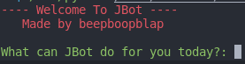

# jbot-virtual-assistant




A virtual assistant created using python

JBot is a virtual assistant that may assist you in certain ways. For example if you need a corny joke to crack you up on your most depressing days, or maybe a stopwatch to time how long you could hold a plank for and much more! 

**The assistant has a number bugs as it was released recently** 

# Usage

1. Install ```python```, link to an installation guide: https://realpython.com/installing-python/

2. Must install the following modules for certain JBot commands (copy and paste to terminal)

```
pip install pyjokes
```
```
pip install google
```
```
pip install requests
```

# JBot commands

Enter these words for the/a ...

- Date
- Time
- Weather
- Stopwatch
- Google (must input 'google' first to search for something)
- Joke 
- Flip (flip a coin)
- Name, Age, Gender etc. (the bot's info)
- password (generates a very strong password)
- rps (play rock, paper, scissors with JBot)
- --version (for JBot version)
- quit (to quit the bot)


*Disclaimer: The weather location is currently set for Hong Kong as the default (I wil change this later).*
